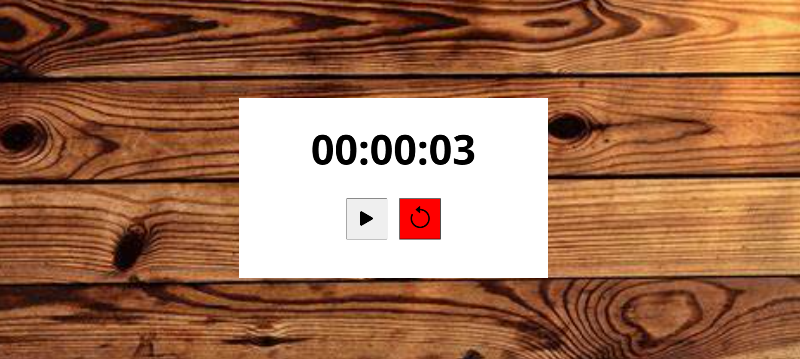

  
🔴 Redmi: Este cronómetro está diseñado para medir el tiempo con precisión. Puedes iniciar, pausar y reiniciar el cronómetro según tus necesidades.

  
🕒 Utiliza los botones:

  <ul>
    <li>👉 <i class="bi bi-play-fill"></i> para iniciar o pausar el cronómetro.</li>
    <li>👉 <i class="bi bi-arrow-counterclockwise"></i> para reiniciar el cronómetro a cero.</li>
  </ul>
  
⏰ El tiempo se muestra en el siguiente formato: 00:00:00.

  

    
  

